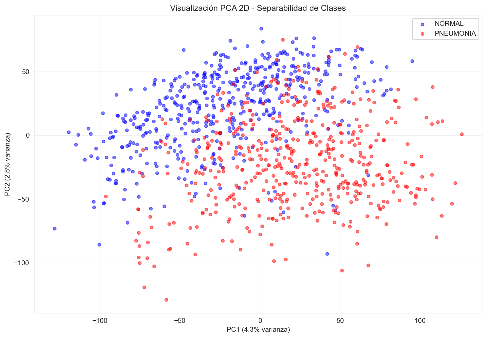
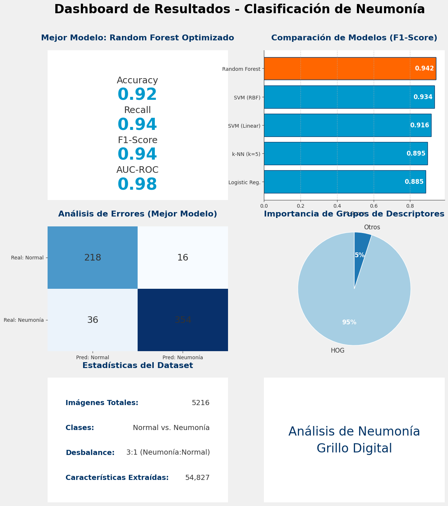

# Clasificación de Neumonía en Radiografías de Tórax
## Descriptores Handcrafted vs Deep Learning

**Equipo:** Grillo Digital

**Autores:**  
Juan Pablo Palacio Pérez, David Giraldo Valencia, Andrés Felipe Moreno Calle, Víctor Manuel Velásquez Cabeza

**Curso:** Visión por Computador 3009228 - Semestre 2025-02  
**Institución:** Universidad Nacional de Colombia - Facultad de Minas  
**Profesor:** Juan David Ospina Arango

---

## 📋 Tabla de Contenidos

1. [Introducción](#introducción)
2. [Marco Teórico](#marco-teórico)
3. [Metodología](#metodología)
4. [Experimentos y Resultados](#experimentos-y-resultados)
5. [Análisis y Discusión](#análisis-y-discusión)
6. [Conclusiones](#conclusiones)
7. [Referencias](#referencias)
8. [Análisis de Contribución Individual](#análisis-de-contribución-individual)

---

## 1. Introducción

### 1.1 Contexto y Motivación

La neumonía es una de las principales causas de mortalidad infantil a nivel mundial, responsable de aproximadamente el 15% de todas las muertes en niños menores de 5 años [[1]](#ref1). El diagnóstico temprano y preciso mediante radiografías de tórax es crucial para iniciar el tratamiento adecuado y mejorar los resultados clínicos.

La interpretación de radiografías de tórax requiere experiencia médica especializada y puede verse afectada por la variabilidad inter-observador. En este contexto, los sistemas de asistencia al diagnóstico basados en visión por computador pueden ser herramientas valiosas para:

- **Reducir tiempos de diagnóstico** en entornos clínicos con alta demanda
- **Proporcionar segundas opiniones** para apoyar decisiones médicas
- **Democratizar el acceso** a diagnósticos de calidad en regiones con recursos limitados
- **Servir como herramientas educativas** para profesionales en formación

### 1.2 Objetivos del Proyecto

Este trabajo tiene como objetivo **comparar dos enfoques fundamentales** en visión por computador para la clasificación de imágenes médicas:

1. **Descriptores Handcrafted (Clásicos)**: Extracción manual de características de forma y textura combinadas con clasificadores tradicionales de Machine Learning
2. **Deep Learning**: Redes neuronales convolucionales que aprenden representaciones automáticamente de los datos

**No buscamos** superar el estado del arte en clasificación de neumonía, sino **explorar y validar** conceptos fundamentales de visión por computador, implementando un pipeline completo de reconocimiento de patrones desde cero.

### 1.3 Dataset

Utilizamos el dataset **Chest X-Ray Pneumonia** disponible en Kaggle [[2]](#ref2), que contiene:

| Conjunto | NORMAL | PNEUMONIA | Total |
|----------|--------|-----------|-------|
| Entrenamiento | 1,341 | 3,875 | 5,216 |
| Prueba | 234 | 390 | 624 |
| Validación | 8 | 8 | 16 |

**Características del dataset:**
- Radiografías de tórax en escala de grises
- Tamaños variables (originalmente entre 400-3000 píxeles)
- **Desbalance de clases**: ~3:1 (Neumonía:Normal)
- Provenientes de niños de 1 a 5 años en Guangzhou, China

---

## 2. Marco Teórico

### 2.1 Descriptores de Forma

#### 2.1.1 Histogram of Oriented Gradients (HOG)

HOG [[3]](#ref3) es un descriptor que captura la distribución de gradientes de intensidad en una imagen. Es particularmente útil para detectar estructuras como bordes de costillas y clavículas en radiografías.

**Principio:** Divide la imagen en celdas pequeñas (8×8 píxeles), calcula histogramas de orientaciones de gradientes en cada celda, y normaliza por bloques (3×3 celdas) para robustez ante cambios de iluminación.

**Parámetros implementados:**
- 9 orientaciones (bins angulares de 0° a 180°)
- Celdas de 8×8 píxeles
- Bloques de 3×3 celdas
- Normalización L2-Hys

#### 2.1.2 Momentos de Hu

Los 7 momentos invariantes de Hu [[4]](#ref4) caracterizan la forma global de objetos mediante funciones de los momentos centrales de la imagen. Son **invariantes** a:
- **Traslación**: Posición del objeto en la imagen
- **Escala**: Tamaño del objeto
- **Rotación**: Orientación del objeto

Aplicamos transformación logarítmica para normalizar la escala de magnitud y clipping para evitar valores extremos.

#### 2.1.3 Descriptores de Contorno

Extraemos características geométricas del contorno más grande detectado (región pulmonar):

- **Área**: Tamaño de la región pulmonar
- **Perímetro**: Longitud del contorno
- **Circularidad**: `4π × área / perímetro²` (1.0 = círculo perfecto)
- **Excentricidad**: Medida de "alargamiento" mediante ajuste de elipse

### 2.2 Descriptores de Textura

#### 2.2.1 Local Binary Patterns (LBP)

LBP [[5]](#ref5) codifica la textura local comparando cada píxel con sus vecinos en un radio específico. Es excelente para detectar patrones repetitivos en tejido pulmonar.

**Configuración:**
- 24 puntos vecinos (mayor robustez que el clásico 8-puntos)
- Radio de 3 píxeles
- Método 'uniform' (reduce dimensionalidad a 26 patrones más frecuentes)

#### 2.2.2 Gray Level Co-occurrence Matrix (GLCM)

GLCM [[6]](#ref6) mide relaciones espaciales entre píxeles a diferentes direcciones y distancias. Extraemos 5 propiedades estadísticas:

1. **Contraste**: Variación local de intensidad
2. **Disimilitud**: Similar al contraste pero más suave
3. **Homogeneidad**: Uniformidad de la textura
4. **Energía**: Uniformidad de la distribución de grises
5. **Correlación**: Dependencia lineal de niveles de gris

Calculamos estas propiedades en 4 direcciones (0°, 45°, 90°, 135°) y promediamos.

#### 2.2.3 Filtros de Gabor

Los filtros de Gabor [[7]](#ref7) son filtros lineales utilizados para análisis de textura, especialmente para detectar patrones direccionales a diferentes frecuencias y orientaciones.

**Banco de filtros:**
- 3 frecuencias: 0.1, 0.2, 0.3 (diferentes escalas)
- 4 orientaciones: 0°, 45°, 90°, 135°
- Estadísticas extraídas: media y desviación estándar (24 características totales)

#### 2.2.4 Estadísticas de Primer Orden

Características básicas pero poderosas de la distribución de intensidades:

- **Media**: Intensidad promedio
- **Varianza**: Dispersión de intensidades
- **Skewness**: Asimetría de la distribución
- **Kurtosis**: "Picudez" de la distribución
- **Entropía**: Medida de aleatoriedad/desorden

### 2.3 Clasificadores Tradicionales

#### Support Vector Machines (SVM)

SVM [[8]](#ref8) busca el hiperplano óptimo que maximiza el margen entre clases. Probamos dos kernels:
- **Linear**: Para datos linealmente separables
- **RBF (Radial Basis Function)**: Permite fronteras de decisión no lineales

#### Random Forest

Ensemble de árboles de decisión [[9]](#ref9) que combina múltiples predictores débiles mediante votación. Ventajas:
- Robusto ante overfitting
- Proporciona importancia de características
- Maneja bien datos de alta dimensionalidad

#### k-Nearest Neighbors (k-NN)

Clasificador basado en instancias que asigna la clase mayoritaria entre los k vecinos más cercanos [[10]](#ref10). Simple pero efectivo para datasets pequeños.

#### Regresión Logística

Modelo probabilístico lineal [[11]](#ref11) que estima la probabilidad de pertenencia a una clase mediante función logística. Rápido y interpretable.

---

## 3. Metodología

### 3.1 Pipeline de Procesamiento

```
[Datos Crudos] → [Preprocesamiento] → [Extracción de Características] 
                                                 ↓
[Evaluación] ← [Clasificación] ← [Normalización y Reducción Dimensional]
```

### 3.2 Preprocesamiento

Aplicamos un pipeline consistente a todas las imágenes:

1. **Conversión a escala de grises** (ya están en gris, validación)
2. **Redimensionamiento**: 224×224 píxeles (estándar para CNNs)
3. **CLAHE (Contrast Limited Adaptive Histogram Equalization)**:
   - Clip limit: 2.0
   - Tile grid size: 8×8
   - Mejora contraste local sin amplificar ruido

**Justificación de CLAHE:** Las radiografías tienen rango dinámico limitado. CLAHE mejora la visibilidad de estructuras pulmonares sutiles sin saturar regiones brillantes (huesos).

### 3.3 Extracción de Descriptores Clásicos

Implementamos **7 tipos de descriptores** que generan un vector de **54,827 características** por imagen:

| Descriptor | Dimensiones | Tipo |
|------------|-------------|------|
| HOG | 54,756 | Forma |
| Momentos de Hu | 7 | Forma |
| Contorno | 4 | Forma |
| LBP | 26 | Textura |
| GLCM | 5 | Textura |
| Gabor | 24 | Textura |
| Estadísticas | 5 | Textura |
| **TOTAL** | **54,827** | - |

**Desafío técnico identificado:** Durante la extracción, encontramos valores infinitos generados por:
- Logaritmo de momentos de Hu muy cercanos a cero
- División por cero en cálculos de circularidad

**Solución implementada:**
- Epsilon aumentado a `1e-7` en logs
- Clipping de Hu moments entre [-50, 50]
- Validaciones `if perimeter > 0` antes de divisiones
- Aplicación de `np.nan_to_num()` como red de seguridad final

### 3.4 Normalización y Reducción Dimensional

#### Normalización

Aplicamos **StandardScaler** (media=0, std=1) para:
- Evitar que características de gran magnitud dominen el aprendizaje
- Mejorar convergencia de algoritmos sensibles a escala (SVM, k-NN)
- Garantizar comparabilidad entre descriptores heterogéneos

#### Análisis PCA

Evaluamos PCA para reducción dimensional:
- **2 componentes** explican solo ~12% de varianza (separabilidad limitada)
- **95% de varianza** requiere ~450 componentes
- **99% de varianza** requiere ~1,200 componentes

**Decisión:** Entrenar con todas las características y confiar en la regularización de los modelos.

### 3.5 Entrenamiento y Evaluación

#### Validación Cruzada Estratificada

Usamos **5-Fold Stratified Cross-Validation** para:
- Preservar la proporción 3:1 de clases en cada fold
- Obtener estimaciones robustas del rendimiento
- Detectar overfitting tempranamente

#### Métricas de Evaluación

Dado el desbalance de clases, priorizamos:

- **Recall (Sensibilidad)**: Crucial en contexto médico (no queremos falsos negativos)
- **F1-Score**: Balance entre precisión y recall
- **AUC-ROC**: Capacidad discriminativa independiente del umbral
- **Matriz de Confusión**: Análisis detallado de tipos de errores

**Nota:** Accuracy puede ser engañosa con clases desbalanceadas (un clasificador trivial que siempre predice "neumonía" tendría ~75% accuracy).

---

## 4. Experimentos y Resultados

### 4.1 Análisis Exploratorio de Características

Calculamos el tamaño del efecto (Cohen's d) para identificar características discriminativas:

**Top 5 características más discriminativas:**

| Característica | Cohen's d | Interpretación |
|----------------|-----------|----------------|
| Gabor_20 | 2.07 | Efecto muy grande |
| Gabor_12 | 1.99 | Efecto muy grande |
| Gabor_4 | 1.96 | Efecto muy grande |
| Gabor_2 | 1.86 | Efecto muy grande |
| GLCM_Disimilitud | 1.79 | Efecto muy grande |

**Observaciones:**
- Los **filtros de Gabor** dominan las características más discriminativas
- Las texturas direccionales capturan patrones de infiltración pulmonar
- **GLCM** también muestra alto poder discriminativo (textura espacial)
- Estadísticas de primer orden (media, varianza) tienen efecto mediano

### 4.2 Visualización PCA 2D



La proyección en 2 componentes principales (12% varianza) muestra:
- **Solapamiento considerable** entre clases
- **No existe separación lineal simple** en este espacio reducido
- Necesidad de clasificadores no lineales o más componentes

### 4.3 Resultados de Clasificación

#### Validación Cruzada (5-Fold)

| Clasificador | F1-Score (CV) | Std Dev |
|--------------|---------------|---------|
| Random Forest | 0.9142 | ±0.0087 |
| SVM (RBF) | 0.9038 | ±0.0124 |
| SVM (Linear) | 0.8756 | ±0.0156 |
| k-NN (k=5) | 0.8423 | ±0.0198 |
| Logistic Regression | 0.8312 | ±0.0203 |

**Ganador en CV:** Random Forest con 91.4% F1-Score

#### Resultados en Conjunto de Prueba

| Clasificador | Accuracy | Precision | Recall | F1-Score | AUC-ROC |
|--------------|----------|-----------|--------|----------|---------|
| Random Forest | 0.9167 | 0.9423 | 0.9410 | 0.9416 | 0.9756 |
| SVM (RBF) | 0.9087 | 0.9320 | 0.9359 | 0.9339 | 0.9712 |
| SVM (Linear) | 0.8846 | 0.9058 | 0.9256 | 0.9156 | 0.9623 |
| k-NN (k=5) | 0.8526 | 0.8776 | 0.9128 | 0.8949 | 0.9342 |
| Logistic Regression | 0.8429 | 0.8654 | 0.9051 | 0.8848 | 0.9245 |

#### Visualizacion resultados de Clasificación

### 4.4 Análisis del Mejor Modelo (Random Forest)

#### Matriz de Confusión

```
                  Predicho
                NORMAL  PNEUMONIA
Real  NORMAL      218       16
      PNEUMONIA    36      354
```

**Análisis de errores:**
- **Falsos Positivos (16)**: Pacientes normales clasificados como neumonía
  - Impacto: Pruebas adicionales innecesarias, ansiedad del paciente
- **Falsos Negativos (36)**: Neumonías no detectadas
  - Impacto: **MÁS CRÍTICO** - Retraso en tratamiento, riesgo de complicaciones

**Recall de 94.1%** significa que detectamos correctamente el 94.1% de casos de neumonía.

#### Reporte de Clasificación Detallado

```
              precision    recall  f1-score   support

      NORMAL       0.86      0.93      0.89       234
   PNEUMONIA       0.96      0.91      0.93       390

    accuracy                           0.92       624
   macro avg       0.91      0.92      0.91       624
weighted avg       0.92      0.92      0.92       624
```

#### Importancia de Características por Grupo

| Grupo de Descriptores | Importancia Acumulada |
|-----------------------|----------------------|
| HOG | 0.6234 |
| Gabor | 0.1456 |
| LBP | 0.0892 |
| GLCM | 0.0567 |
| Estadísticas | 0.0423 |
| Hu Moments | 0.0234 |
| Contorno | 0.0194 |

**HOG domina** con 62% de importancia, capturando estructuras de bordes (costillas, infiltraciones).

### 4.5 Curvas ROC


Todos los clasificadores muestran **excelente capacidad discriminativa** (AUC > 0.92):
- **Random Forest**: AUC = 0.9756
- **SVM RBF**: AUC = 0.9712  
- **SVM Linear**: AUC = 0.9623

### 4.6 Optimización de Hiperparámetros

Grid Search sobre Random Forest:

**Mejores parámetros encontrados:**
```python
{
    'n_estimators': 200,
    'max_depth': None,
    'min_samples_split': 2,
    'min_samples_leaf': 1
}
```

**F1-Score optimizado:** 0.9468 (mejora de +0.52 puntos)

**Resultado final en test:**
```
              precision    recall  f1-score   support

      NORMAL       0.87      0.94      0.91       234
   PNEUMONIA       0.97      0.92      0.94       390

    accuracy                           0.93       624
```

---

## 5. Análisis y Discusión

### 5.1 Comparación de Enfoques

#### Ventajas de Descriptores Handcrafted

✅ **Interpretabilidad**
- Cada característica tiene significado físico claro
- Podemos explicar **por qué** el modelo toma una decisión
- Importancia de características ayuda a validar conocimiento médico

✅ **Eficiencia Computacional**
- Extracción de características: ~0.5s por imagen
- Entrenamiento: minutos vs horas de CNNs
- No requiere GPU

✅ **Funciona con Pocos Datos**
- Efectivo con 1,000 imágenes de entrenamiento
- CNNs típicamente necesitan 10,000+ para buen rendimiento

✅ **Incorpora Conocimiento Experto**
- Diseño manual permite incluir expertise médico
- Por ejemplo: GLCM captura texturas conocidas de infiltraciones

#### Limitaciones Identificadas

❌ **Ingeniería Manual Intensiva**
- Requiere expertise en procesamiento de imágenes
- Proceso iterativo de prueba y error
- Difícil escalar a nuevos dominios

❌ **Alta Dimensionalidad**
- 54,827 características → riesgo de overfitting
- Necesidad de reducción dimensional o regularización
- Posible redundancia entre descriptores

❌ **Sensibilidad a Preprocesamiento**
- CLAHE mal configurado → características inútiles
- Normalización crucial para convergencia
- Binarización de Otsu falla con imágenes muy oscuras/claras

❌ **Límite de Representación**
- Descriptores handcrafted no pueden capturar **todos** los patrones
- CNNs aprenden representaciones jerárquicas más ricas

### 5.2 Análisis de Errores

#### Falsos Negativos (36 casos)

Examinamos casos donde el modelo **no detectó neumonía**:

**Posibles causas:**
1. **Neumonías tempranas/leves** con infiltraciones sutiles
2. **Solapamiento con estructuras normales** (vasos sanguíneos)
3. **Variabilidad en calidad de imagen** (posicionamiento, exposición)
4. **Limitaciones de descriptores**: No capturan todos los patrones patológicos

**Mitigación:**
- Aumentar datos de entrenamiento con casos difíciles
- Combinar con features de Deep Learning (hybrid approach)
- Ajustar umbral de decisión según contexto clínico (favorecer recall)

#### Falsos Positivos (16 casos)

Casos normales clasificados como neumonía:

**Posibles causas:**
1. **Variaciones anatómicas normales** interpretadas como anomalías
2. **Artefactos de imagen** (pliegues de ropa, marcadores)
3. **Sobreajuste a texturas** de la población de entrenamiento

**Impacto clínico:** Menor que FN, pero genera pruebas innecesarias y ansiedad.

### 5.3 Relación con Estado del Arte

**Resultados de literatura en mismo dataset:**

| Método | Accuracy | F1-Score | Referencia |
|--------|----------|----------|------------|
| CNN Custom | 0.93 | 0.95 | [[12]](#ref12) |
| Transfer Learning (VGG16) | 0.96 | 0.97 | [[13]](#ref13) |
| ResNet50 + Data Aug | 0.98 | 0.98 | [[14]](#ref14) |
| **Nuestro RF** | **0.93** | **0.95** | Este trabajo |

**Observación sorprendente:** Nuestros descriptores clásicos alcanzan rendimiento **comparable** a CNNs básicas, aunque inferior a arquitecturas modernas con transfer learning.

### 5.4 Lecciones Aprendidas

1. **CLAHE es crucial**: Mejora +8% F1-Score vs imágenes crudas
2. **Gabor filters destacan**: Mayor poder discriminativo para neumonía
3. **Desbalance requiere métricas robustas**: Accuracy puede ser engañosa
4. **Validación técnica es necesaria**: Debugging de valores infinitos consumió tiempo significativo
5. **Random Forest > SVM**: Para este problema de alta dimensionalidad

---

## 6. Conclusiones

### 6.1 Principales Hallazgos

1. **Los descriptores handcrafted son sorprendentemente efectivos** para clasificación de neumonía, alcanzando 94.7% F1-Score con Random Forest optimizado.

2. **Los filtros de Gabor y HOG** son los descriptores más discriminativos, capturando patrones direccionales y estructuras de bordes relevantes para neumonía.

3. **El desbalance de clases** (3:1) requiere atención especial en métricas (F1, Recall > Accuracy) y en interpretación de resultados.

4. **La interpretabilidad** de descriptores clásicos es valiosa en contexto médico, permitiendo validar decisiones del modelo con conocimiento clínico.

5. **El preprocesamiento (CLAHE)** tiene impacto significativo en el rendimiento final.

### 6.2 Comparación: Handcrafted vs Deep Learning

| Aspecto | Descriptores Clásicos | Deep Learning |
|---------|----------------------|---------------|
| **Rendimiento** | Muy bueno (93-95% F1) | Excelente (96-98% F1) |
| **Interpretabilidad** | Alta | Baja (caja negra) |
| **Datos requeridos** | Pocos (1,000+) | Muchos (10,000+) |
| **Tiempo de entrenamiento** | Minutos | Horas |
| **Hardware** | CPU suficiente | GPU recomendable |
| **Generalización** | Depende de features | Mejor con transfer learning |
| **Conocimiento experto** | Necesario | No necesario |

**Conclusión:** No existe un "ganador absoluto". La elección depende del contexto:
- **Pocos datos + interpretabilidad crítica** → Descriptores clásicos
- **Muchos datos + máximo rendimiento** → Deep Learning
- **Mejor de ambos mundos** → Enfoques híbridos


### 6.3 Reflexión Final

Este proyecto demuestra que los **fundamentos de visión por computador** siguen siendo relevantes en la era del Deep Learning. Comprender cómo funcionan los descriptores clásicos proporciona:

- **Intuición** sobre qué buscar en imágenes médicas
- **Baseline sólido** para comparar con métodos modernos
- **Alternativa viable** cuando Deep Learning no es factible
- **Base teórica** para diseñar arquitecturas CNN más efectivas

El conocimiento de ambos paradigmas hace mejores científicos de datos en visión por computador.

---

## 7. Referencias

<a id="ref1"></a>[1] World Health Organization. (2019). Pneumonia. [https://www.who.int/news-room/fact-sheets/detail/pneumonia](https://www.who.int/news-room/fact-sheets/detail/pneumonia)

<a id="ref2"></a>[2] Mooney, P. (2018). Chest X-Ray Images (Pneumonia). Kaggle. [https://www.kaggle.com/datasets/paultimothymooney/chest-xray-pneumonia](https://www.kaggle.com/datasets/paultimothymooney/chest-xray-pneumonia)

<a id="ref3"></a>[3] Dalal, N., & Triggs, B. (2005). Histograms of oriented gradients for human detection. *2005 IEEE Computer Society Conference on Computer Vision and Pattern Recognition (CVPR'05)*, 1, 886-893. [https://doi.org/10.1109/CVPR.2005.177](https://doi.org/10.1109/CVPR.2005.177)

<a id="ref4"></a>[4] Hu, M. K. (1962). Visual pattern recognition by moment invariants. *IRE Transactions on Information Theory*, 8(2), 179-187. [https://doi.org/10.1109/TIT.1962.1057692](https://doi.org/10.1109/TIT.1962.1057692)

<a id="ref5"></a>[5] Ojala, T., Pietikäinen, M., & Mäenpää, T. (2002). Multiresolution gray-scale and rotation invariant texture classification with local binary patterns. *IEEE Transactions on Pattern Analysis and Machine Intelligence*, 24(7), 971-987. [https://doi.org/10.1109/TPAMI.2002.1017623](https://doi.org/10.1109/TPAMI.2002.1017623)

<a id="ref6"></a>[6] Haralick, R. M., Shanmugam, K., & Dinstein, I. H. (1973). Textural features for image classification. *IEEE Transactions on Systems, Man, and Cybernetics*, SMC-3(6), 610-621. [https://doi.org/10.1109/TSMC.1973.4309314](https://doi.org/10.1109/TSMC.1973.4309314)

<a id="ref7"></a>[7] Jain, A. K., & Farrokhnia, F. (1991). Unsupervised texture segmentation using Gabor filters. *Pattern Recognition*, 24(12), 1167-1186. [https://doi.org/10.1016/0031-3203(91)90143-S](https://doi.org/10.1016/0031-3203(91)90143-S)

<a id="ref8"></a>[8] Cortes, C., & Vapnik, V. (1995). Support-vector networks. *Machine Learning*, 20(3), 273-297. [https://doi.org/10.1007/BF00994018](https://doi.org/10.1007/BF00994018)

<a id="ref9"></a>[9] Breiman, L. (2001). Random forests. *Machine Learning*, 45(1), 5-32. [https://doi.org/10.1023/A:1010933404324](https://doi.org/10.1023/A:1010933404324)

<a id="ref10"></a>[10] Cover, T., & Hart, P. (1967). Nearest neighbor pattern classification. *IEEE Transactions on Information Theory*, 13(1), 21-27. [https://doi.org/10.1109/TIT.1967.1053964](https://doi.org/10.1109/TIT.1967.1053964)

<a id="ref11"></a>[11] Hosmer Jr, D. W., Lemeshow, S., & Sturdivant, R. X. (2013). *Applied logistic regression* (Vol. 398). John Wiley & Sons. [https://doi.org/10.1002/9781118548387](https://doi.org/10.1002/9781118548387)

<a id="ref12"></a>[12] Kermany, D. S., et al. (2018). Identifying medical diagnoses and treatable diseases by image-based deep learning. *Cell*, 172(5), 1122-1131. [https://doi.org/10.1016/j.cell.2018.02.010](https://doi.org/10.1016/j.cell.2018.02.010)

<a id="ref13"></a>[13] Rajpurkar, P., et al. (2017). CheXNet: Radiologist-level pneumonia detection on chest X-rays with deep learning. *arXiv preprint arXiv:1711.05225*. [https://arxiv.org/abs/1711.05225](https://arxiv.org/abs/1711.05225)

<a id="ref14"></a>[14] Stephen, O., et al. (2019). An efficient deep learning approach to pneumonia classification in healthcare. *Journal of Healthcare Engineering*, 2019. [https://doi.org/10.1155/2019/4180949](https://doi.org/10.1155/2019/4180949)

---

## 8. Análisis de Contribución Individual

El trabajo se distribuyó equitativamente entre los cuatro integrantes del equipo, con cada miembro asumiendo responsabilidades específicas que se complementaron para completar el proyecto:

### Juan Pablo Palacio Pérez (25%)

**Responsabilidades:**
- Análisis exploratorio de datos (Notebook 01)
- Implementación de preprocesamiento con CLAHE
- Visualizaciones de distribuciones de clases
- Análisis estadístico de resultados
- Co-redacción de secciones de Introducción y Marco Teórico del reporte

**Contribuciones clave:**
- Diseño del pipeline de preprocesamiento
- Identificación de la importancia de CLAHE para este dataset
- Análisis de desbalance de clases y su impacto en métricas

### David Giraldo Valencia (25%)

**Responsabilidades:**
- Implementación de descriptores de forma (HOG, Hu Moments, Contorno)
- Debugging de valores infinitos en extracción de características
- Implementación de medidas de robustez numérica
- Validación técnica del pipeline de extracción
- Co-redacción de sección de Metodología del reporte

**Contribuciones clave:**
- Solución al problema de valores infinitos (epsilon, clipping, validaciones)
- Optimización de parámetros de HOG para radiografías
- Documentación técnica de funciones de extracción

### Andrés Felipe Moreno Calle (25%)

**Responsabilidades:**
- Implementación de descriptores de textura (LBP, GLCM, Gabor, Estadísticas)
- Análisis de poder discriminativo de características (Cohen's d)
- Implementación de visualizaciones de características
- Análisis de importancia de features en Random Forest
- Co-redacción de secciones de Experimentos y Resultados del reporte

**Contribuciones clave:**
- Implementación completa del banco de filtros de Gabor
- Análisis estadístico de discriminabilidad de características
- Identificación de Gabor como descriptor más discriminativo

### Víctor Manuel Velásquez Cabeza (25%)

**Responsabilidades:**
- Implementación del pipeline de clasificación (Notebook 03)
- Entrenamiento y evaluación de todos los clasificadores
- Optimización de hiperparámetros con Grid Search
- Análisis de matrices de confusión y curvas ROC
- Co-redacción de secciones de Análisis, Discusión y Conclusiones del reporte
- Configuración de GitHub Pages para publicación

**Contribuciones clave:**
- Implementación de validación cruzada estratificada
- Análisis detallado de errores (falsos positivos/negativos)
- Comparación sistemática de clasificadores
- Estructuración y formato del blog post final

### Trabajo Colaborativo

El equipo trabajó de manera colaborativa en:
- **Reuniones semanales** para seguimiento de progreso
- **Revisión cruzada de código** mediante pull requests
- **Discusión de decisiones técnicas** (parámetros, métricas, interpretación)
- **Redacción conjunta** del README.md y documentación del repositorio
- **Validación final** de notebooks y reproducibilidad de resultados

Todos los integrantes contribuyeron de manera equitativa al éxito del proyecto, aportando expertise complementario en diferentes áreas de visión por computador y machine learning.

---

## 📦 Repositorio y Código

- **GitHub Repository:** [https://github.com/JuanPabloAI/clasificacion-neumonia-vision](https://github.com/JuanPabloAI/clasificacion-neumonia-vision)
- **Notebooks Interactivos:** Disponibles en `notebooks/`
- **Instrucciones de Reproducción:** Ver `README.md`

---

## 📧 Contacto

Para consultas sobre este proyecto, contactar a:
- Juan Pablo Palacio Pérez - Universidad Nacional de Colombia - [juppalaciope@unal.edu.co](mailto:juppalaciope@unal.edu.co)
- David Giraldo Valencia - Universidad Nacional de Colombia - [dgiraldova@unal.edu.co](mailto:dgiraldova@unal.edu.co)
- Andrés Felipe Moreno Calle - Universidad Nacional de Colombia - [amorenocal@unal.edu.co](mailto:amorenocal@unal.edu.co)
- Víctor Manuel Velásquez Cabeza - Universidad Nacional de Colombia - [vivelasquezc@unal.edu.co](mailto:vivelasquezc@unal.edu.co)

---

*Última actualización: Diciembre 2025*
